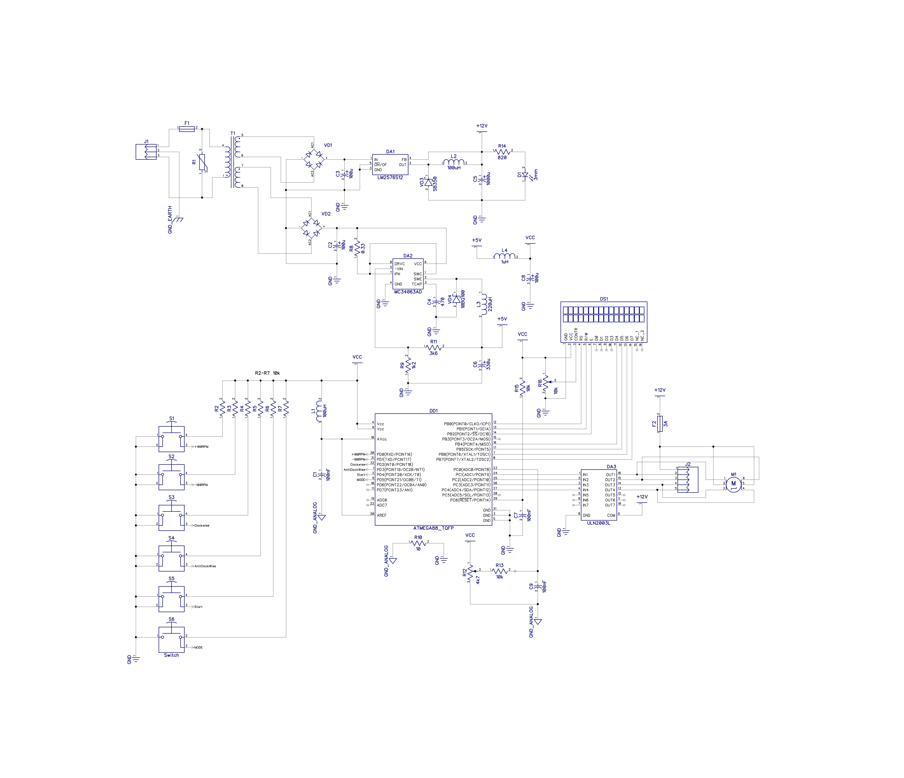

# <b>StepperMotorController</b>
## Test task at Hardware developer position in Silego Technology 
<ul>
  <li>Example project for unipolar stepper motor; </li>
</ul>
<ul>
  <li>Source code is written on Atmel studio in C language;</li> 
</ul>
<ul>
   <li>Used Atmega 88 microcontroller with internal RC oscillator on 8 Mhz;</li> 
</ul>
<ul>
   <li>Used 16 x 2 LCD with hd44780 for state indication;</li> 
</ul>

NOTE! I commented some lines looks like <code> // && (timer == DEBOUNCE)) </code>

because it doesn't work in Proteus simulation process;

The "Circuit" folder contains the DipTrace 3.0.0.1 file with the device circuit;

The "Firmware" folder contains the Atmel Studio project with the main program;

The "Modeling" folder contains the Proteus simulation project which illustrates how the controller works;

